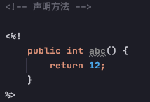
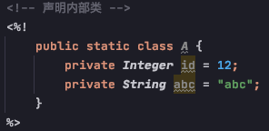

# jsp

### Definition
    - Java Server Pages - Java 服务器页面
    - jsp 的主要作用代替 servlet 程序回传 html 页面的数据
    - 因为 servlet 程序回传 html 页面数据是一件非常繁琐的事情。开发成本和维护成本都极高
    
    
### 本质
    - jsp 页面本质上是一个 servlet 程序
    - 当我们第一次访问 jsp 页面的时候，Tomcat 服务器会帮我们把 jsp 页面翻译成一个 java 源文件
    并且对它进行编译，成为.class字节码程序
    - 被翻译的 java 源文件继承了 HttpJspBase 类，而 HttpJspBase 类直接地继承了 HttpServlet 类，
    也就是说，jsp 就是一个 servlet 程序， 其底层也是通过输出流，把 html 页面数据回传给客户端
    - 总结: 通过翻译的 java 源代码我们就可以可到结论: jsp 就是 servlet 程序

### jsp 头部的 page 指令

    Definition: 可以修改 jsp 页面中一些重要的属性，或者行为
    
    常用属性: 
        language =====> 表示 jsp 翻译后是什么语言文件，暂时只支持 java
        contentType =====> 表示 jsp 返回的数据类型是什么，也是源码中 response.setContentType() 参数值
        pageEncoding =====> 表示当前 jsp 页面文件本身的字符集
        import =====> 跟 java 源代码一样，用于导包，导类
        
        (以下两个是给 out 输出流使用)
        autoFlush =====> 设置当 out 输出流缓冲区满了之后，是否自动刷新缓冲区，默认是 true
        buffer =====> 设置 out 缓冲区的大小，默认是 8kb
        
        errorPage =====> 设置当前jsp页面运行时出错，自动跳转去的错误页面路径: "/" 代表 http://ip:port/工程路径/
        isErrorPage =====> 设置当前jsp页面是否是错误信息页面，默认是 false; 如果是 true 可以获取异常信息
        session =====> 设置访问当前jsp页面是否会创建 HttpSession 对象，默认是 true
        extends =====> 设置jsp 翻译出来的java类默认继承谁，一般不推荐修改o(￣ヘ￣o＃)
    

### jsp 的中常用的 Script

1) Declaration Script (声明脚本)  -  声明 类的属性/方法/静态代码块/内部类     （极少使用)

        格式: <%!  %>

        - 声明属性

       - 声明静态代码块

       - 声明方法

       - 声明内部类

2) Expression Script (表达式脚本)  -  在 jsp 页面上输出数据        (常用)

        格式: <%=  %>
        
        1) 所有的表达式脚本都会被翻译到_jspService() 方法中
        2) 表达式脚本都会被翻译成为 out.print() 输出到页面上
        3) 由于表达式脚本翻译的内容都在 _jspService() 方法中，所以_jspService() 方法中的对象都可以直接使用, eg: request.getParameter("user")
        4) 表达式脚本中的表达式不能以分号结束
        

3) Scriptlet (代码脚本)  -  在jsp页面中，编写我们自己需要的功能 (写的是java 语句)        (最常用 最强大)
    
        格式: <% java语句 %>
        
        
