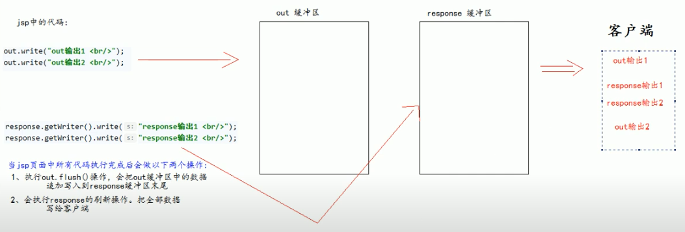
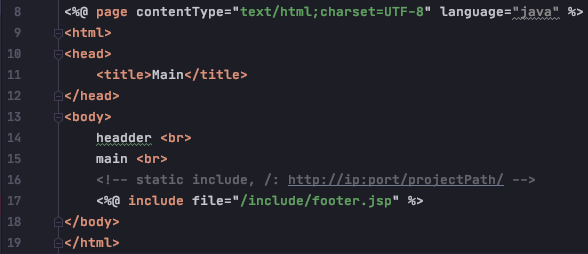
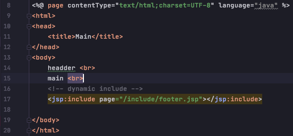

# jsp objects

## jsp 的九大内置对象

    1) request          请求对象 x
    2) response         响应对象
    3) pageContext      jsp的上下文对象  x
    4) session          会话对象 x
    5) application      servletContext对象  x
    6) config           ServletConfig对象
    7) out              jsp 输出流对象
    8) page             指向当前jsp的对象
    9) exception        异常对象
    
    

###  四个域对象 - 可以存/取数据, 功能一样，不同的是他们对数据的存取范围

    1) pageContext  == pageContextImpl class     == 当前 jsp 页面范围有效
    2) request      == httpServletRequest class  == 一次请求内有效
    3) session      == httpSession class         == 一次会话范围内有效 (打开浏览器访问服务器，直到关闭浏览器)
    4) application  == servletContext class      == 整个web工程范围内都有效 (只要web工程不停止数据都在)
    
    注意: 存放数据的优先级 (从小到大): page --> request --> session --> application 如果无需使用了就立刻释放
    
    
     
### out 和 response 对象

    1) response 表示响应，常用于设置返回给客户端的内容 (输出)
    2) out 也是给用户做输出使用的

jsp 底层的操作过程：

由于 jsp 翻译之后，底层源代码都会使用 out 来进行输出，所以我们在 jsp 页面中也统一使用 out 来进行输出，以避免
打乱页面输出内容的顺序。

    - out.write()  输出字符串没问题, 但整数会出问题，因为 (char) int 这波操作得到的是ASCII 对应的 char
    - out.print()  输出任意数据都没问题 （底层是先将数据转化成字符串，然后使用 out.write() 输出)

    Note:
        
        - (char) int  是得到一个ASCII Decimal 对应的 char
        - (int) char  是得到一个ASCII char 对应的 Decimal

 
# 结论：在jsp页面中可以统一使用out.print() 来输出任何类型数据

### static include     (常用)

    
        - 静态包含不会翻译被包含的 jsp 页面
        - 本质上是把被包含的 jsp 页面的代码拷贝到包含的位置执行输出

### dynamic include

        - 动态包含会把包含的 jsp 页面也翻译成为 java 代码
        - 动态包含底层代码使用如下，代码去调用被包含的jsp页面执行输出
                JspRuntimeLibrary.include(request, response, "/include/footer.jsp", out , false);
        
